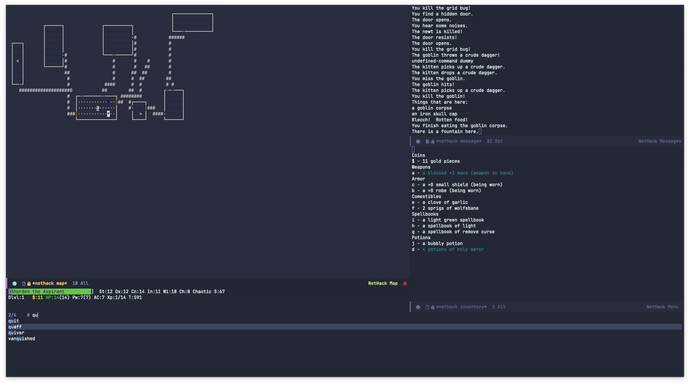

# `nethack-el`

What happens when you combine the most advanced, self-documenting, customizable,
extensible real-time display editor, Emacs, with nethack, the most elaborate
role-playing environment ever invented?

You get the most advanced, elaborate, self-documenting, customizable,
extensible, role-playing environment in the world!

All of the Elisp is GPLv3-or-later, and the patches are under the modified 3-clause BSD.



## Features

* Customizable keys
* Customizable colors
* Macros
* Event hooks
* All the beauty that comes with Emacs

## Project Status
I am semi-actively adding new features and fixing bugs as of August 2025.
I mostly work on things that affect how I play NetHack (e.g. my `nethackrc`), so please open an issue/PR if something doesn't work—it's likely I just don't use that feature and never ran into that particular issue.

> [!IMPORTANT]
> nethack-el only supports versions 3.6.7 and 3.7.0-WIP of NetHack.
> Please do not open issues with using nethack-el with versions of NetHack older than 3.6.7.


Previous repo: <https://github.com/be11ng/nethack-el>

Old website: <http://savannah.nongnu.org/projects/nethack-el>

## Build and run

These instructions are known to work on \*NIX systems and have been lightly tested on Windows.

### Easy installation

* Install the Elisp sources

  * Add the `nethack-el` folder to your Emacs load-path.

  * Make sure you have all of your dependencies installed.  You'll need `make`,
    `gcc`, `bison` or `yacc`, `flex` or `lex`, and the ncurses-dev library for
    your system.

    * On Windows you'll need MSYS2 with `mingw-w64-ucrt-x86_64-gcc` and `make` installed, and make sure `C:\msys64\usr\bin` is in `exec-path`.

> [!NOTE]
> nethack-el only supports NetHack 3.7.0 on Windows.

  * Play with `M-x nethack RET`. This should automatically detect if NetHack w/ lisp patch is installed, and if not will attempt to build it from source.

### Manual Build

* Download either `nethack-367.tgz` from <https://nethack.org> or `git clone https://github.com/NetHack/NetHack.git` (required for using NetHack-3.7 branch)

* Untar the package and apply the respective patch

  For example, if you were installing 3.6.7, you would do something like:

  ```
  $ tar xzf nethack-367-src.tgz
  $ cp enh-367.patch NetHack-NetHack-3.6.7_Released
  $ cd NetHack-NetHack-3.6.7_Released
  $ patch -p 1 < enh-367.patch
  ```

* Follow the instructions in `sys/*/Install.*` or `NewInstall.*`

  * This may be as simple as running `sys/unix/setup.sh` to copy the Makefiles.

  * For the 3.6.7/3.7.0 patch, included is a hints file under
    `sys/unix/hints/lisp` based on the default Linux one, which builds
    into wherever the `PREFIX` environment variable points to at runtime.  You
    may want to edit the `lisp` hints file before running something along
    the lines of:

    ```
    $ cd sys/unix
    $ vi hints/lisp
    $ sh setup.sh hints/lisp
    ```

* Compile (from the toplevel)

  * Following the instructions as outlined so far, that would be:

    ```
    $ cd ../..
    $ make all
    $ make install
    ```

* Install the Elisp sources

  * Edit the Makefile in the `nethack-el` directory to set the location of your
    Emacs.

  * Byte compile (not strictly necessary).

    ```
    $ cd .. # Or wherever nethack-el is located
    $ make all
    ```

  * Place the `*.elc` or `*.el` files in your load-path.

  * Add the following lines somewhere inside your `init.el`:

    ```elisp
    (autoload 'nethack "nethack" "Play Nethack." t)
    (setq nethack-program "/PATH/TO/PATCHED/nethack")
    ```

  * Play with `M-x nethack RET`.

## Testing
Either use `(ert-run-tests-interactively)` in a live Emacs session or invoke Emacs in batch mode like so:
```
emacs --batch -L nethack-el -l nethack-el/test/nethack-tests.el --eval '(ert-run-tests-batch-and-exit)'
```
